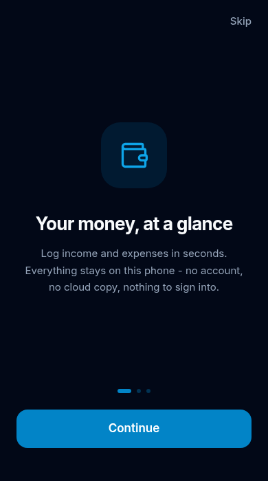
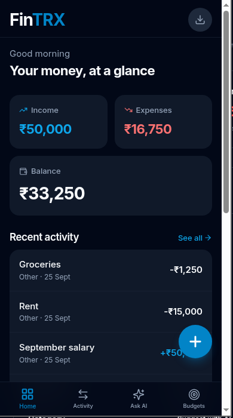
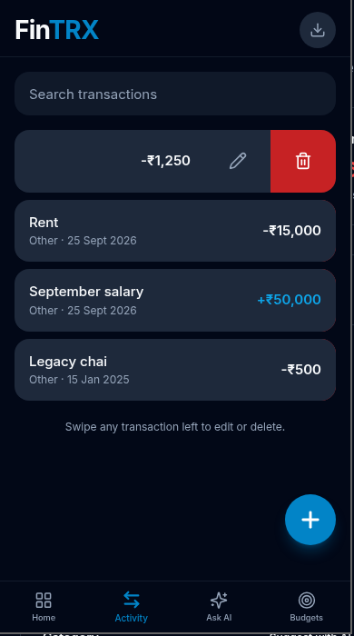
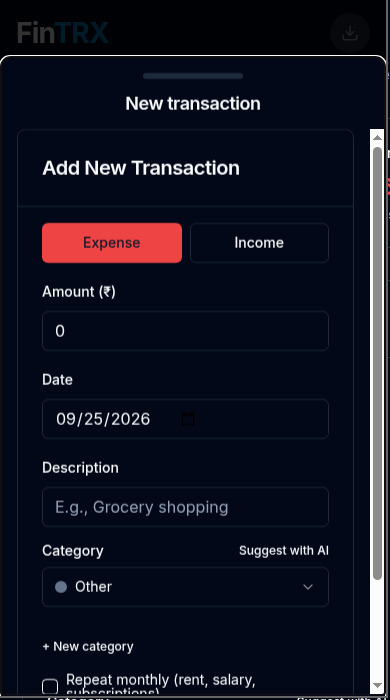
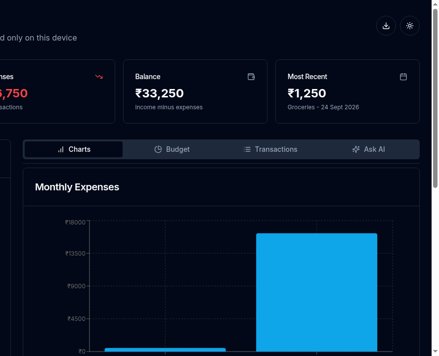

<div align="center">
  

  # FinTRX

  **Your money, on your device. Nowhere else.**

  A local-first personal finance tracker for Android and the web - no accounts, no cloud copy of your finances, and an AI you can ask about your own spending.

  [](https://github.com/rizvihasan/fintrx/actions/workflows/android.yml)
  [](https://github.com/rizvihasan/fintrx/releases)
  [](https://fintrx.vercel.app)
  [](LICENSE)

  **[Download the Android app](https://github.com/rizvihasan/fintrx/releases/latest)** · **[Open the web app](https://fintrx.vercel.app)** · **[Privacy](https://fintrx.vercel.app/privacy)**
</div>

---

## The Android app

FinTRX is built phone-first. First open gives you a three-screen onboarding, then drops you straight into the app - no landing page, no sign-up, no website pretending to be an app. Every open after that goes directly to your money.

<p align="center">
  
  
  
  
</p>

**Install:** grab the APK from the [latest release](https://github.com/rizvihasan/fintrx/releases/latest), open it on your phone, and allow the install when Android asks. First launch walks you through three quick screens and you're in.

| | |
|---|---|
| **Bottom tab navigation** | Home, Activity, Ask AI, and Budgets, always a thumb-reach away |
| **Gesture-driven rows** | Swipe a transaction left to edit or delete - it tracks your finger, flicks open on a fast swipe, springs to rest |
| **Spring physics everywhere** | Tab transitions, staggered lists, count-up balances, a FAB that reacts to your touch |
| **Bottom-sheet forms** | Add or edit in a sheet that swipes away |
| **Haptics** | Taps, adds, and deletes you can feel |
| **No website chrome** | Hidden scrollbars, momentum scrolling, safe-area aware, themed status bar |

Signed release builds (a sideloadable APK and a Play-ready AAB) are produced by GitHub Actions on every push to `master`.

## The web app

The same tracker runs at **[fintrx.vercel.app](https://fintrx.vercel.app)** - the tracker itself lives at `/app`.

<p align="center">
  
</p>

On desktop you get a full dashboard - charts, budgets, transactions, and Ask AI side by side. On a phone-sized screen the web app adapts into the same mobile shell as the native app. Data is stored per device, so your phone and laptop each keep their own books.

## Features

**Track**
- Income and expenses in INR with Indian spending categories
- Custom categories, or let the AI suggest one from your description
- Recurring monthly transactions for rent, salary, and subscriptions
- Monthly expense chart with income / expense / balance summaries

**Budget**
- Per-category monthly budgets
- Progress bars that turn red the moment you cross a limit

**Ask AI**
- Plain-language questions about your own money - "How much did I spend on groceries this month?"
- Monthly insights generated from your actual transactions
- Runs through FinTRX's own stateless proxy, so the API key never ships to your device

**Own your data**
- Everything lives in your device's local storage (IndexedDB via Dexie)
- One-tap CSV export, any time
- No account system, no FinTRX server holding your data

## Privacy

Transactions, budgets, and categories never leave your device. FinTRX stores nothing server-side. Ask AI sends one stateless request per question through FinTRX's proxy to the AI provider (Groq); the provider's own privacy policy governs that request, and FinTRX retains nothing from it. Full text: [fintrx.vercel.app/privacy](https://fintrx.vercel.app/privacy).

## Tech stack

| Layer | Choice |
|---|---|
| App shell | Capacitor (Android), signed CI builds |
| UI | React 18, TypeScript, Vite, Tailwind CSS, shadcn/ui |
| Motion | framer-motion (spring physics, gestures) |
| Data | Dexie (IndexedDB) - fully local-first |
| AI | Stateless Vercel serverless proxy over Groq |
| CI/CD | GitHub Actions (signed AAB + APK), Vercel (web) |

## Project structure

```
src/
  components/
    native/        # the mobile app shell: tabs, sheets, swipe rows, screens
    ui/            # shadcn/ui primitives
  hooks/           # Dexie-backed data hooks
  lib/             # db (Dexie), ai client, platform (haptics, status bar)
  pages/           # web routes: landing, app, privacy
android/           # Capacitor Android project
api/               # stateless AI proxy (Vercel serverless)
.github/workflows/ # signed Android release builds
docs/screenshots/  # screenshots used in this README
```

## Develop

```bash
npm install
npm run dev            # web app at localhost:5173

npx cap sync android   # then open android/ in Android Studio
```

The AI proxy needs `GROQ_API_KEY` in your Vercel (or `.env`) environment; the app works without it minus Ask AI.

## Release

Every push to `master` runs `.github/workflows/android.yml`: it builds the web bundle, syncs Capacitor, and assembles a signed release AAB and APK using the keystore stored in GitHub secrets (`ANDROID_KEYSTORE_BASE64`, `ANDROID_KEYSTORE_PASSWORD`, `KEY_ALIAS`, `KEY_PASSWORD`). Publishing a GitHub release attaches those artifacts.

## Roadmap

- Home-screen widget (balance at a glance)
- Encrypted backup / restore between devices
- Google Play listing (signed AAB already builds)
- iOS via the same Capacitor shell

## Contributing

Issues and PRs are welcome. Keep the privacy model intact: finance data stays on-device, and any network feature must be stateless.

## License

[MIT](LICENSE) - use it, fork it, ship your own.
